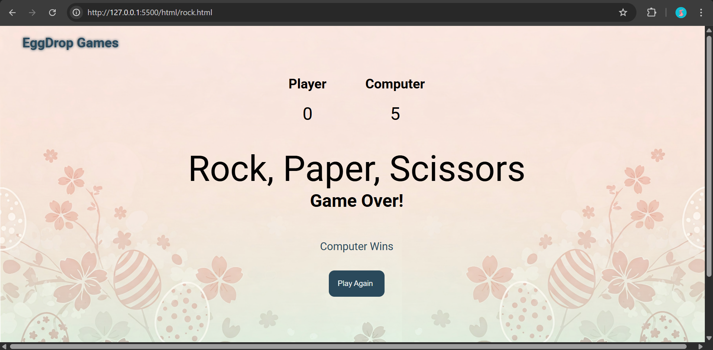
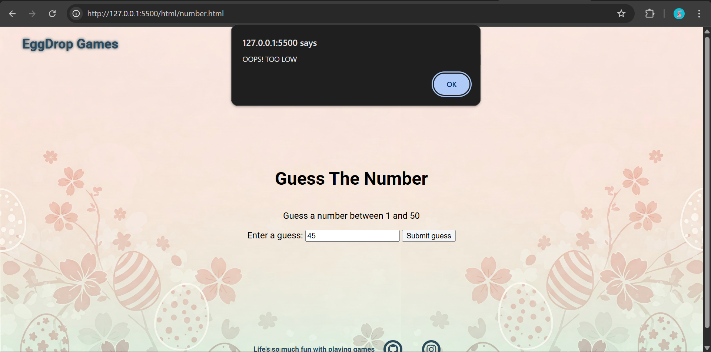
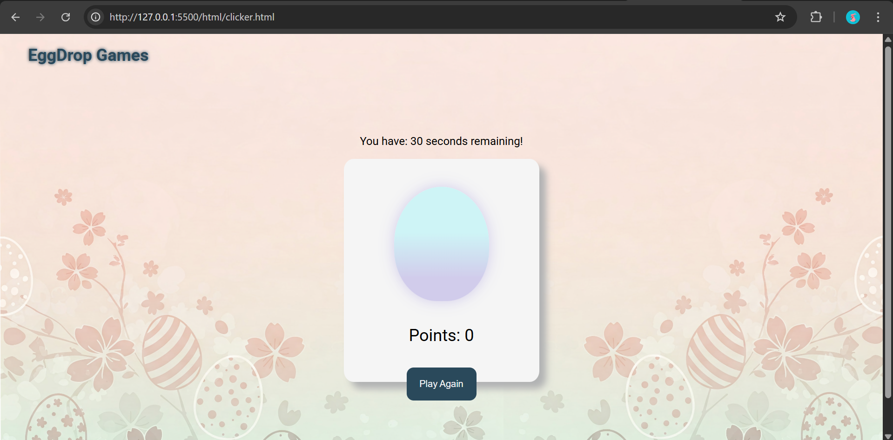

# Milestone 2 Project

## Overview

This is an overview of EggDrop Games website. The features, tech stacks, and demo of this website is described down below.

## Features

* Navigation Bar : Allows visitors to move easily between sections
* Home Section : Shows visitors an overview about me
* About Section : Shows visitors about my journey as software engineer
* Projects Section : Shows visitors about my projects
* Contact Form Section : Allows visitors to reach me out
* Transition effects
* Animation on projects section
* Blinking cursor effect
* Javascript for interactive games

## Technologies Used

* HTML for stucturing this website
* CSS for styling this website
* Javascript for interactive games

## How to use

1. Clone this repository below to your local repository

> https://github.com/revou-fsse-feb25/milestone-2-egaherawati10.git

2. Open 'index.html' file in a browser

## Deployed Website :

> Github Pages: https://revou-fsse-feb25.github.io/milestone-2-egaherawati10/

## Previews

Rock, Paper, Scissors

Number Guessing

Clicker

## Creator

&copy; Ega Herawati, 2025